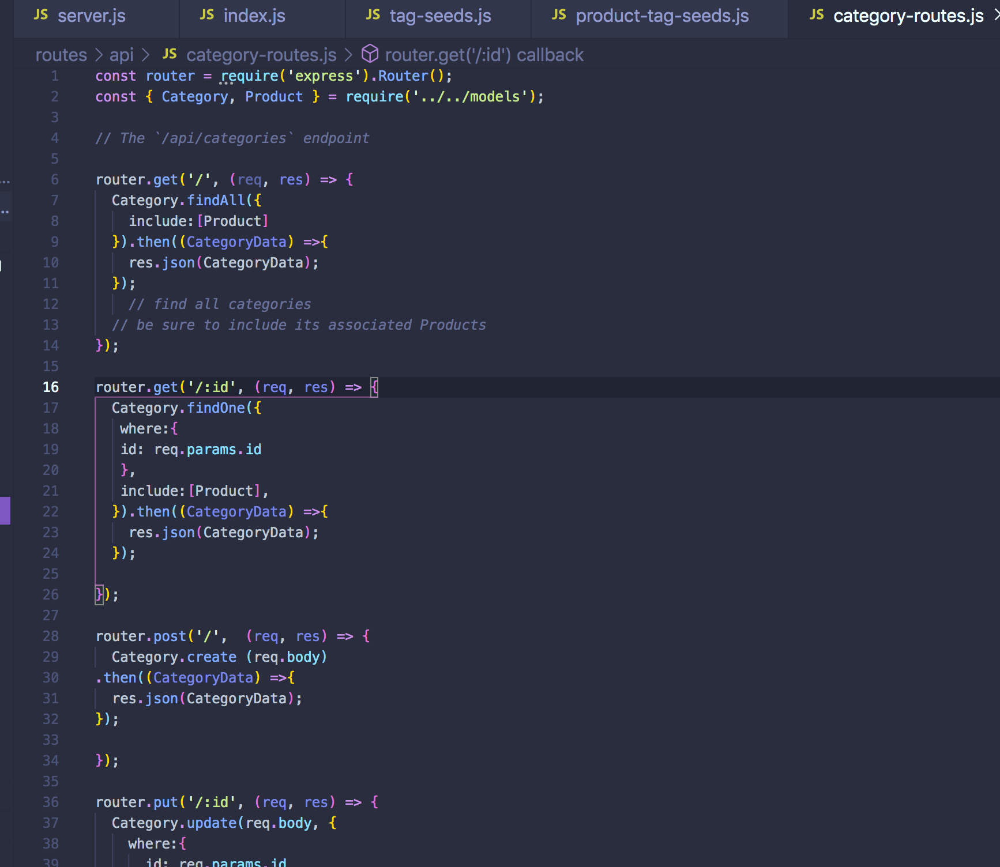

# ecommerce-backend

## Overview

This application is a simple e-commerce site that introduces the concepts behind the largest section of the electronic industry "internet retail". This application is mainly backend with Express.js API in order use Sequelize which interacts with a MySQL database.

## Index
* Installation

* Built with 

* Dependencies

* Testing

* Contribution

* Questions

## Installation
The application requires Node.js and MySQL. 
## Built with: 
- HTML
- 
## Dependencies
dotenv
express
mysql2
sequelize
## Testing
n/a 

## Contribution
n/a

## Questions
If you have any questions about the application my Github user name is Dobinator and my email is dobsonemily@gmail.com

Video link to view running of the program: 

https://youtu.be/-eKld6YEKYA

screenshot of backend code:

